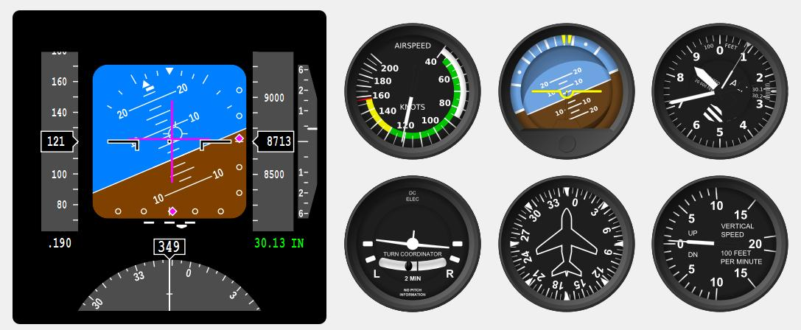

# qfi

This is a fork of https://github.com/doughodson/qfi in order to use CMake instead of qmake to build the project. Like this the qfi library can easily be used as a submodule in other CMake projects.

The original Qt Flight Control Instruments project posted on SourceForge in 2015.  It was named "QFlightInstruments" and can be found here:

https://sourceforge.net/projects/qfi/

This package allows you to create nice looking instruments (and a panel or cluster of them) as shown below.



# Compilation
Assuming that you have installed `Qt` on your system set the following variable (either every time you want to compile the project or in your `.bashrc/.zshrc`):
```bash
export QT5_CMAKE_DIR="/PATH_TO_INSTALLATION/Qt/5.11.2/gcc_64/lib/cmake"
```
If you have a different version installed on your system, change the path accordingly.

In order to compile the project go into a terminal and execute the following:
```bash
cd build
cmake ..
make
```
Now you should be able to run the example program like this:
```bash
./example
```
